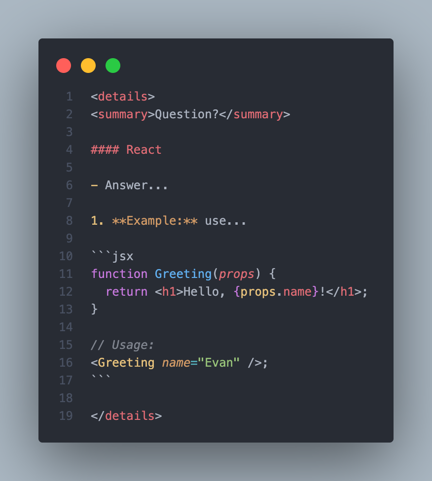

# 🧠 How to contribute to DevLovers

Thank you for wanting to contribute to our project! Below are some simple rules
to help you prepare a quality pull request.

## 🔧 Supplement format

- Each question should be formatted in an HTML element `
` with the
  structure:

